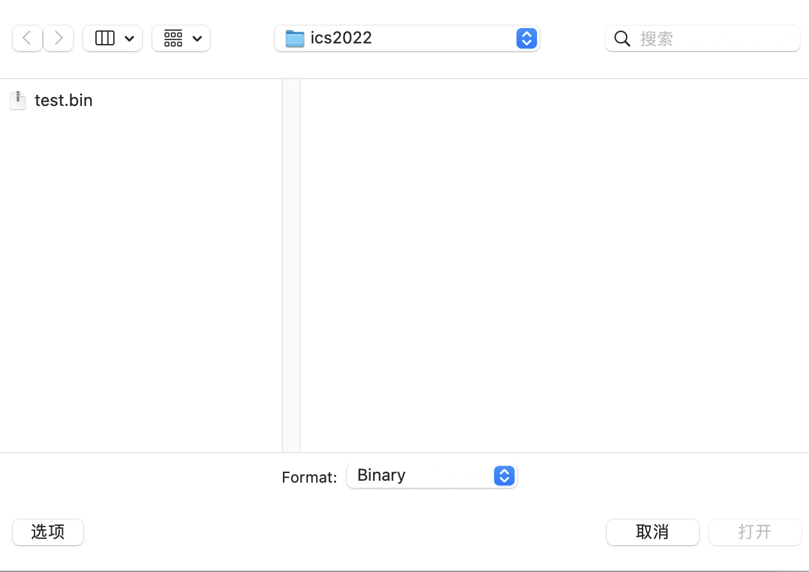
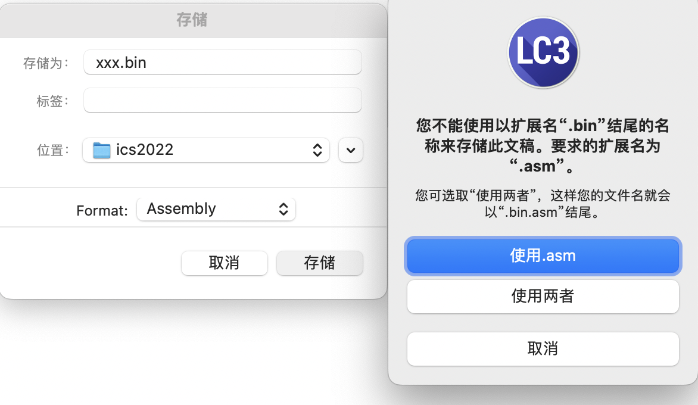

# LC3 tools Q&A

## MacOS 下的问题

### Q: 下载后打不开应用

A: 首先 Mac 需要下载的是 `.dmg` 不是 `.exe`. 如果下载正确在应用程序里会有 `LC3Tools.app`, 之后如果双击该程序打不开，请参考 [Apple 支持的解决方案](https://support.apple.com/zh-cn/HT202491#:~:text=%E5%A6%82%E6%9E%9C%E6%82%A8%E4%BB%8D%E6%83%B3%E6%89%93%E5%BC%80,%E5%8F%AF%E4%BB%A5%E7%82%B9%E6%8C%89%E2%80%9C%E6%89%93%E5%BC%80%E2%80%9D%E3%80%82).

### Q: 在访达 (finder) 里新建 .bin 文件后无法编辑

A: 用 vscode 打开该文件所在的文件夹即可。

### Q: LC3Tools 里无法打开 .bin 文件

如下图，在选项 -> Format 里修改为 Binary 即可。

如果出现下面这种情况：

也是把 Format 改成 Binary

## 关于使用

请大家先阅读 [GuideToUsingLC3Tools](https://ics-ustc.feishu.cn/file/boxcnRfUzUimYIVPTmeiFIAPDCe) 以了解基本的使用方法。

### Q: 加了 halt (Trap x25) 指令后程序依然无法停止

A: 参考第 19 页 "Setting a breakpoint at the halt instruction" 部分，在 halt 指令处打断点即可。
