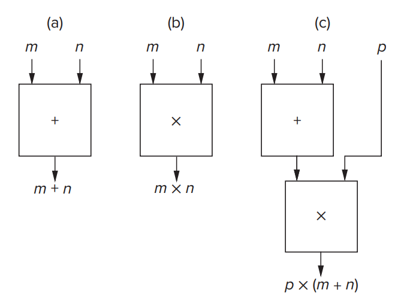
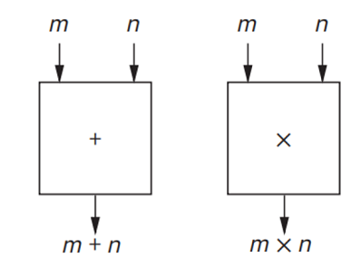

# 作业一

## 作业说明

- 作业可以使用中文或英文完成

- BB 系统提交电子版 PDF，允许手写拍照、latex、markdown、word 等

- DDL：10.3 23:59

- [答案](hw1_answer)

- 本次作业 [PDF](/pdf/hw1.pdf)

## T1

> Adapted from P20 1.5

Say we had a “black box,” which takes two numbers as input and outputs their sum. See Figure 1.10a.

Say we had another box capable of multiplying two numbers together. See Figure 1.10b.

We can connect these boxes together to calculate p × (m + n). See Figure 1.10c.

Figure 1.10 from page 20

Assume we have an unlimited number of these boxes. Show how to connect them together to calculate:  

a. $ax\ +\ b$

b. The average of the four input numbers w, x, y, and z

c. $x^2-y^2$

d. $a^6$

## T2

(1) Convert these decimal numbers to **eight-bit** 2's complement binary numbers.

a. 98

b. -105

(2) Convert the following **eight-bit** 2's complement binary numbers to decimal.

c. 01000010

d. 11101111

## T3

Add the following 2's complement binary numbers. Also express the answer in **decimal**.

a. 01 + 110011

b. 111 + 0100110

c. 1010 + 1101

d. 0001 + 1110

## T4

**Without changing their values**, convert the following 2's complement binary numbers into **eight-bit** 2's complement numbers.

a. 101011

b. 011110

c. 11111111110000

d. 00001

## T5

Write IEEE floating point representation of $(4.3)_D$. If you cannot represent accurately, please try to represent a number which has the closest difference to $(4.3)_D$. **(Actually you may just write the first ten digits of the fractional part.)**

> Can you try to write code in C language to confirm your correctness? (Tips: type `float` in C language follows the rule of 32bit IEEE floating)
>
> What if the exponent bits are all 1? Search for information about that.

## T6

Write the decimal equivalents for the IEEE floating point number below.

0 10001001 11111001101001000000000

## T7

(1) Compute the following. Write answers in binary.

a. 10100101 AND 11010101

b. 10001110 OR 11110101

c. NOT(11110001) OR NOT(01011010)

(2) Compute the following. Write answers in hexadecimal.

d. (x1234 AND x5678) OR (xABCD AND x99EF)

e. x6A12 XOR x3A15

## T8

Fill in the truth table for the equations given

$$Q_1 = (A\ AND\ B)\ OR\ NOT(C)$$
$$Q_2 = NOT(NOT(A)\ OR\ NOT(B))\ AND\ C$$
Express Q2 another way (with only AND)

## T9

Steps to convert ASCII string to base64:

1. Write the ASCII string in bits.
2. Divide each 24 bits into one group. In each group, divide the bits into 4 subgroups and convert each subgroup using the following rule:
   - 0-25 corresponds to A-Z
   - 26-51 corresponds to a-z
   - 52-61 corresponds to 0-9
   - 62 corresponds to + and 63 corresponds to /.
3. If the subgroup is less than 6 bits, add 0 to its lower position.
4. If the last group is 8 bits, add "==" to the end of the encoded string. If the last group is 16 bits, add just one "=".

> For example, in order to convert "M", first write it as binary:01001101. The first subgroup is 010011(19), corresponds to "T". The last subgroup is 010000(added 4 zeros), corresponds to "Q"(16). Since the last group is 8 bits, we should add \"\=\=\" at the end of the encoded string to indicate this. The final base64 encoding is "TQ==".

(1) Convert ASCII string "\t\n\r" to base64. 
Hint:'\t', '\n' and '\r' are "escape characters", you can search for information about "escape characters" online if you don't know where to get the ASCII values of them. You can also try to program in C to help you get the ASCII values.

(2) Give a example where base64 encoding can be used.

## T10

What is the largest positive number that can be represented by an IEEE floating point number (Normalized Form)?

## T11

> Consider the situation: We want to calculate $0.11\times 0.022$; however, we can only calculate integer numbers. How can we do that?
> Obviously we can calculate $11 \times 22$ and add dot to the number. However, determining where to put the dot may be difficult. If we can easily transform the value into $1.1\times 10^{-1}$ and $2.2\times 10^{-2}$, just calculate $1.1\times 1.1$ and $10^{-1}\times10^{-2}$ (just add $-1$ and $-2$), then put them together.
> However, $0.95\times 0.081$ makes difference, for $9.5\times 8.1=76.95$, which is greater than 10. So we may convert 76.95 into $7.695\times 10^{1}$ and adjust the exponent by increasing 1. So the answer is $7.695\times 10^1\times10^{-3}=7.695\times10^{-2}$.

Now we have two positive float numbers A and B, they follow the rule of 32bit IEEE floating point. For simplicity, we can use A\[0] as the lowest bit of A, A\[31] as the highest, and A\[2:5] as array of A\[4], A\[3] and A\[2], A\[5] is not included. If we attempt to combine two numbers together, we can use big brackets.

For example: if$A=0\ 11110000\ 00000000\ 00000000\ 0000111$, then $A[0]=1$, $A[31]=0$, and $A[2:5]=001$,  $\lbrace 101,A[2:5]\rbrace = 101001$, array in order that high bits are on the left.

- We're required to multiply A and B, result as C; please represent one possible algorithm in the format of "Black Box" same as T1.
  - We assume that 1 \< A, B \< 100;

  - you can use mult boxes to multiply two unsigned integers of 24 bits, and the output is in 48 bits.

    > For example, if input numbers are in two bits, like 10 and 11, then the output is 0110; and input 11 and 11 make 1001. 24-bit inputs are similar.

  - you can also use add boxes of any bits

    

  - You can also use `selector` boxes, which take 3 inputs, a, b, and sel
    - if sel == 0, output = a
    - if sel == 1, output = b

  - number of boxes you can use is unlimited

- (This problem is not required) How about addition? Also assume 1 \< A, B \< 100. You can use `Shift Left` or `Shift Right` if you want. You're encouraged to challenge yourself.
