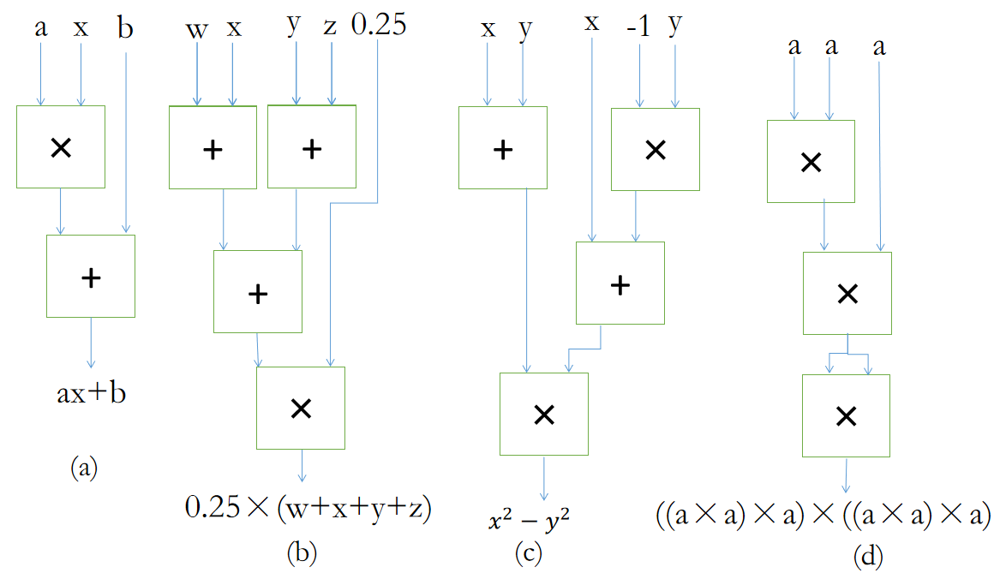

# Homework1 Answer

<p style="text-align:center; font-size:2em; padding: 1em">by ysy</p>

## T1



> 部分同学没有用 black boxes 表示出来，若是考试时需注意按照题目要求。

## T2

$$
\begin{align*}
98 &\rightarrow 01100010 \\
-105 &\rightarrow 11101001 \rightarrow 10010110 \rightarrow 10010111 \\
01000010 &\rightarrow 66 \\
11101111 &\rightarrow 10010000 \rightarrow 10010001 \rightarrow -17
\end{align*}
$$

- 对于正数，原码 = 反码 = 补码
- 对于负数，补码和原码之间的转换均为非符号位取反 + 1

## T3

a. 
  $$\ 01\ +\ 11\_0011\ =\ 00\_0001\ +\ 11\_0011\ =\ 11\_0100\ =\ (-12)_D$$
b.
  $$\ 111\ +\ 010\_0110\ =\ 111\_1111\ +\ 010\_0110\ =\ 010\_0101\ =\ (37)_D$$
c.
  $$\ 1010\ +\ 1101\ =\ 0111 = (7)_D$$
d.
  $$\ 0001\ +\ 1110 = (-1)_D$$

> 首先进行符号扩展至相同位数（和最长的一致），然后进行运算，得到的结果截取相同的位数，不用额外拓展一位。
>
> 详细请看教材 2.5.2 和 2.5.3。

## T4

a. 1110_1011

b. 0001_1110

c. 1111_0000

d. 0000_0001

> 对于不足 8 位的，补符号位至 8 位；对于超过 8 位的，去符号位至 8 位。

## T5

$$4.3 = 100.01\_0011\_0011\cdots = (1.0001\ 0011\ 0011\cdots)\times2^2$$

0 10000001 00010011001100110011010（注意末尾两位）

>可能有同学得到的结果为 0 10000001 00010011001100110011001
>
>但是事实上最后存在进位，（最后几位为 10011，进位为1010）这不作要求，仅作拓展，也即题目描述的与 4.3 最接近的数

示例代码：

```C
#include <stdio.h>

union my_union {
    int   a;
    float b;
};

int main() {
    union my_union t;
    t.b = 4.3;
    for (int loop = 31; loop >= 0; loop--) {
        putchar((t.a & (1 << loop)) == 0 ? '0' : '1');
    }
    return 0;
}
```

指数位全为 1，小数位全为 0 表示无穷，正负号由符号位决定；

指数位全为 1，且小数位不全为 0 则表示 NaN。

## T6

$$10001001 = 137$$

$$(1.11111001101001000000000)\times 2^{137-127} = 111\_1110\_0110.1001 = 2022.5625 = 2022\frac{9}{16}$$

## T7

a. 1010_0101 AND 1101_0101 = 1000_0101

b. 1000_1110 OR 1111_0101 = 1111_1111

c. NOT(1111_0001) OR NOT(0101_1010) = 0000_1110 OR 1010_0101 = 1010_1111

d. (x1234 AND X5678) OR (xABCD AND X99EF) = x1230 OR x89CD = x9BFD

e. x6A12 XOR x3A15 = x5007

## T8

| $A$  | $B$  | $C$  | $Q_1$ | $Q_2$ |
| :--: | :--: | :--: | :---: | :---: |
| $0$  | $0$  | $0$  |  $1$  |  $0$  |
| $0$  | $0$  | $1$  |  $0$  |  $0$  |
| $0$  | $1$  | $0$  |  $1$  |  $0$  |
| $0$  | $1$  | $1$  |  $0$  |  $0$  |
| $1$  | $0$  | $0$  |  $1$  |  $0$  |
| $1$  | $0$  | $1$  |  $0$  |  $0$  |
| $1$  | $1$  | $0$  |  $1$  |  $0$  |
| $1$  | $1$  | $1$  |  $1$  |  $1$  |

$Q_2 = A\ AND\ B\ AND\ C$

## T9

1. 两种解答
   - 转义字符：000010 010000 101000 001101 $\to$ CQoN
   - 非转义字符：010111 000111 010001 011100 011100 100101 110010 101110 $\to$ XHRcblxy
2. 规避格式符号（将非 ASCII 字符的数据转换成 ASCII 字符）、仅允许字符的情况下传递信息（有特殊编码要求的文件，例如 html 文本）等。

## T10

指数位为 254，小数位全为 1。

$$
(\sum_{i=0}^{23}2^i)\times2^{254-127} = (2 - 2^{-23})\times 2^{127} = 2^{128} - 2^{104}
$$

## T11

随意舍入，不管它

1. Mult

$$
\begin{align*}
EXP[0:8]&\leftarrow A[23:31] + B[23:31] + 10000001\\
FRAC[0:48] &\leftarrow \lbrace 1, A[0:23]\rbrace * \lbrace 1, B[0:23]\rbrace\\
C[0:32]&\leftarrow(FRAC[47] ? \lbrace 0, EXP, FRAC[23:46]\rbrace : \lbrace 0, EXP+00000001,FRAC[24:47] \rbrace)
\end{align*}
$$

2. Add

假定 $A \geq B$，则 $A[23:31] \geq B[23:31]$

$$
\begin{align*}
SHIFT &\leftarrow A[23:31]-B[23:31]\\
FRAC[0:25] &\leftarrow\lbrace 01,A[0:23]\rbrace+(\lbrace 01, B[0:23]\rbrace >>SHIFT)\\
C[0:32]&\leftarrow (FRAC[24] ? \lbrace 0, A[23:31]+00000001,FRAC[1:24]\rbrace:\lbrace 0, A[23:31], FRAC[0:23]\rbrace)
\end{align*}
$$

> 以上答案由隔壁班助教提供，下面我作简要解释

题目中限制了 A，B 的范围就是希望不用考虑那些边界情况，也不用考虑 T5 中进位相关。

下面考虑两个 IEEE 浮点数的乘法：

- 对于指数位，可以直接相加，但是注意到真实指数的表示应该为
  $$(A[23:31] - 127) + (B[23:31] - 127) + 127 = A[23:31] + B[23:31] - 127$$
  也即 $A[23:31] + B[23:31] + 10000001$
- 对于小数位，分别在 A，B 的 23 位小数前补一个 1，然后相乘可得 48 位的 FRAC，注意我们需要取**第一个 1** 后面的 **23 位小数**。若 $FRAC[47]$ 为 1，则指数位还需 + 1，小数位取 $FRAC[24:47]$；否则指数位不变，小数位取 $FRAC[23:46]$

为方便理解，再具体一点
$$
\begin{align*}
1.frac_a \times 2^{exp_a} \times 1.frac_b\times2^{exp_b} &= 1.frac_a \times 1.frac_b \times 2^{exp_a + exp_b}\\
1.\underbrace{frac_a}_{23位}\times 1.\underbrace{frac_b}_{23位} &= \underbrace{FRAC[47]FRAC[46]}_{2位}.\underbrace{frac}_{46位}
\end{align*}
$$
如果 $FRAC[47]$ 为 1，则小数点应该再往前点一位，所以指数位还需 + 1；否则 $FRAC[46]$ 为 1，小数点不变，因此指数位不需要 + 1。

对于加法，也是同理可得

$$
\begin{align*}
1.frac_a \times 2^{exp_a} + 1.frac_b\times2^{exp_b} &= (1.frac_a + 1.frac_b\times 2^{exp_b-exp_a}) \times 2^{exp_a}\\
\underbrace{1.frac_a}_{24位} + \underbrace{1.frac_b\times2^{exp_b-exp_a}}_{24位} &= \underbrace{FRAC[24]FRAC[23]}_{2位}.\underbrace{frac}_{23位}
\end{align*}
$$

上述$\times2^{exp_b-exp_a}$ 即 **右移** $exp_a-exp_b$ 位，小数位前面补 01 是考虑得到 25 位的 $FRAC$。其它处理均与乘法类似，不赘述。

## 小结

1. 本次作业中出现的错误主要可分两类

- 一类是各种计算错误，包括十进制与二进制转换、十进制与 IEEE 浮点数转换、位运算等。
- 另一类则是对基础知识掌握的不清楚，例如原码与补码的具体转换方法、关于符号扩展和溢出的处理等

2. 本次作业 T1-T8、T10 为我所出，都是基础题目，考试中一旦涉及基本属于送分题！T9 可作为拓展，简要了解即可；T11 难度较大，主要是为了帮助更好的理解 IEEE 浮点数。
