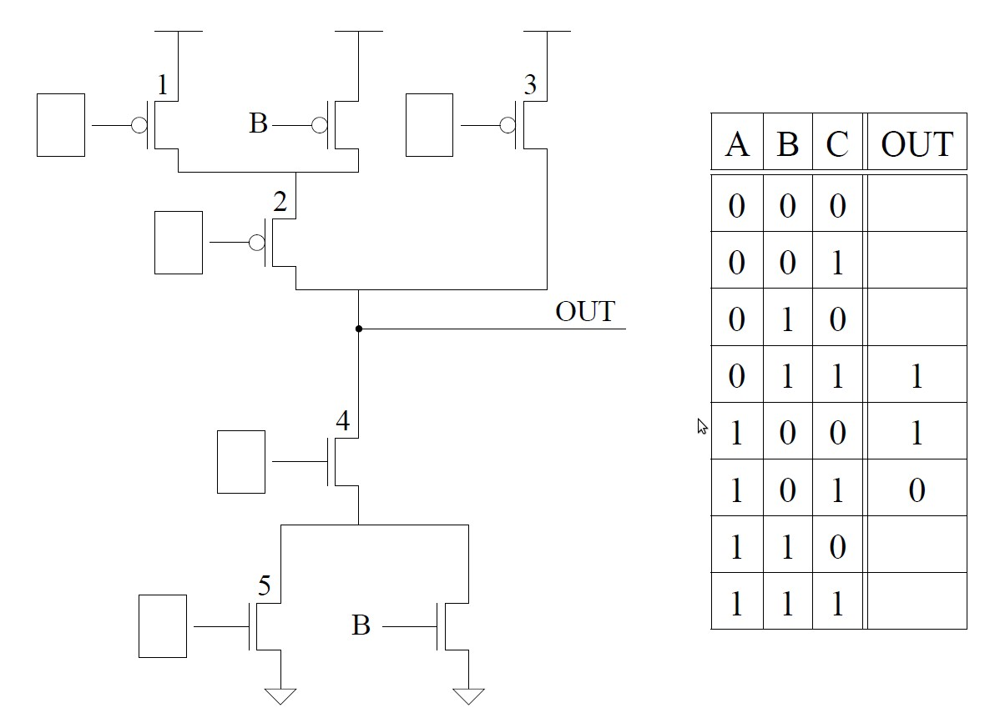
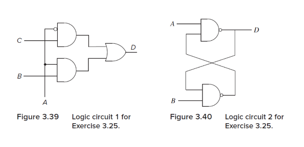
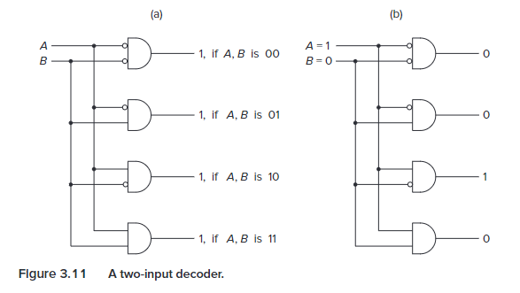
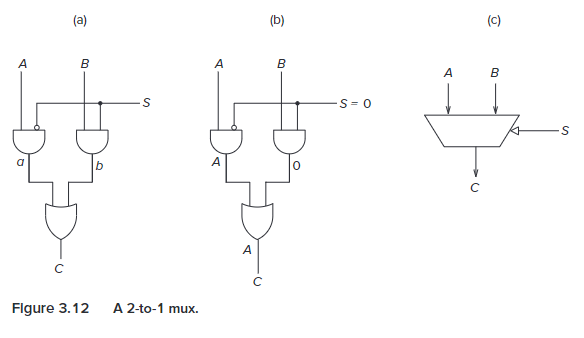
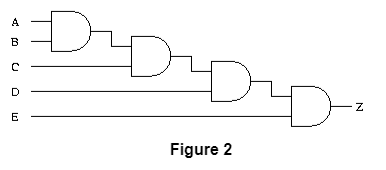
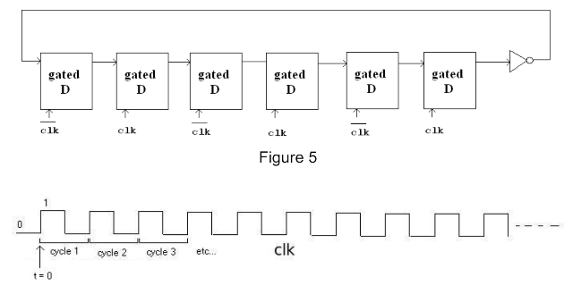
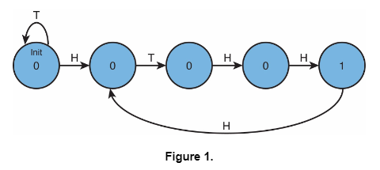
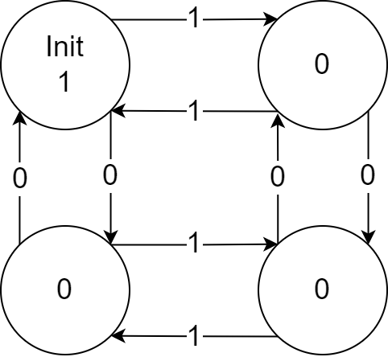

# 作业二

## 作业说明

- 作业可以使用中文或英文完成

- BB 系统提交电子版 PDF，允许手写拍照、latex、markdown、word 等
  - 文件重命名为 `PB21xxxxxx_姓名_作业2.pdf` 的格式

- DDL：10.25 23：30

- [答案](/pdf/hw2_ans.pdf)

- 本次作业 [PDF](/pdf/hw2.pdf)

## T1

(a). What is the **smallest** positive **normalized** number that can be represented using the IEEE 32-bit Floating Point standard?

(b). What is the **largest** positive **subnormal** number that can be represented using the IEEE 32-bit Floating Point standard?

## T2

What is the largest positive number that can be represented in a 32-bit 2's complement scheme?

## T3

Draw the transistor level circuit of a 2 input XOR gate.

## T4

The transistor circuit shown below produces the accompanying truth table. The inputs to some of the gates of the transistors are not specified. Also, the outputs for some of the input combinations of the truth table are not specified. Complete both specifications. i.e., all transistors will have their gates properly labeled with either A, B, or C, and all rows of the truth table will have a 0 or 1 specified as the output.

## T5

Shown below are several logical identities with one item missing in each. X represents the case where it can be replaced by either a 0 or a 1 and the identity will still hold. Your job: Fill in the blanks with either a 0, 1, or X.
For example, in part a, the missing item is X. That is 0 OR 0 = 0 and 0 OR 1 = 1

- 0 OR X = \_\_\_
- 1 OR X = \_\_\_
- 0 AND X = \_\_\_
- 1 AND X = \_\_\_
- \_\_ XOR X = X

## T6

Logic circuit 1 in Figure 3.39 (page 102 of the book) has inputs A, B, C. Logic circuit 2 in Figure 3.40 (page 102 of the book) has inputs A and B. Both logic circuits have an output D. There is a fundamental difference between the behavioral characteristics of these two circuits. What is it?

_Hint_: What happens when the voltage of one input goes from 0 to 1 in both circuits?

## T7

(a). How many output bits does a five-bit-input decoder have?

(b). How many output bits does a 16-to-1 mux have? How many select bits does this mux have?

## T8

Say the speed of a logic structure depends on the largest number of logic gates through which any of the inputs must propagate to reach an output. Assume that a NOT, an AND, and an OR gate all count as one gate delay. For example, the propagation delay for a two-input decoder shown in Figure 3.11 is 2 because some inputs propagate through two gates.

1. What is the propagation delay for the two-input mux shown in Figure 3.12 (page 68)?

   

2. Can you reduce the propagation delay for the circuit shown in Figure 2 by implementing the equation in a different way? If so, how?

   

## T9

A logic circuit consisting of 6 gated D latches and 1 inverter is shown below:

Let the state of the circuit be defined by the state of the 6 D latches. Assume initially the state is 000000 and clk starts at the point labeled t0.
Question: What is the state after 50 cycles? How many cycles does it take for a specific state to show up again?

## T10

Prove that NAND is logically complete.

## T11

Shown below is a partially completed state diagram of a finite state machine that takes an input string of _H_ (heads) and _T_ (tails) and produces an output of 1 every time the string HTHH occurs.

For example, if the input string is:

`H, H, H, H, H, T, H, H, T, H, H, H, H, H, T, H, H, T`
The output would be:

`0, 0, 0, 0, 0, 0, 0, 1, 0, 0, 1, 0, 0, 0, 0, 0, 1, 0`

a) Complete the state diagram of the finite state machine that will do this for any input sequence of any length.

b) If this state machine is implemented with a sequential logic circuit how many state variables will be needed? (Recall, the number of state variables is the same as the number of bits needed to represent all of the states.)

## T12

Now consider a set of strings which only consist 0 and 1. Shown below is a diagram of state machine that takes a string which contains an even number of zeros and an even number of ones.(eg: 000110, 10100011 will be taken, 01011, 111000 will not be taken). Please design a finite state machine to take a string when the unsigned binary number represented by the string is divisible by 5.(eg: 001010, 101 and 0000 are divisible by 5, 01011, 111000 are not not divisible by 5)

> Hint: The number of states can be derived from the remainder when divided by 5.

## T13

If a particular computer has 8 **byte** addressability and a 8 **bit** address space, how many bytes of memory does that computer have?
