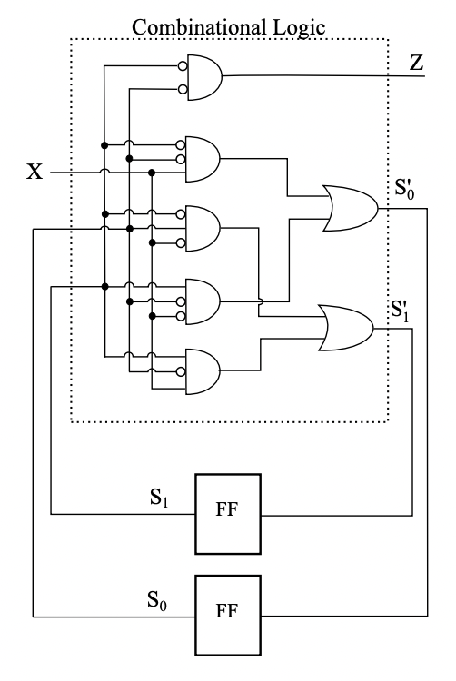
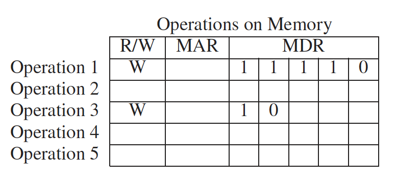
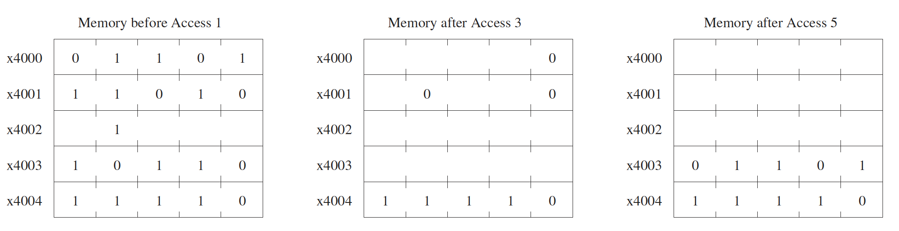

# 作业三

## 作业说明

- 作业可以使用中文或英文完成

- BB 系统提交电子版 PDF，允许手写拍照、latex、markdown、word 等
  - 文件重命名为 `PB21xxxxxx_姓名_作业3.pdf` 的格式

- DDL：10.31 23：30

- 本次作业 [PDF](/pdf/hw3.pdf)

## T1

The logic diagram shown below is a finite state machine.



Your job:

(a). Construct the truth table for the combinational logic:

| $S_1$ | $S_0$ | $X$  | $Z$  | $S_1^\prime$ | $S_2^\prime$ |
| :---: | :---: | :--: | :--: | :----------: | :----------: |
|   0   |   0   |  0   |      |              |              |
|   0   |   0   |  1   |      |              |              |
|   0   |   1   |  0   |      |              |              |
|   0   |   1   |  1   |      |              |              |
|   1   |   0   |  0   |      |              |              |
|   1   |   0   |  1   |      |              |              |
|   1   |   1   |  0   |      |              |              |
|   1   |   1   |  1   |      |              |              |

(b). Draw the state machine.

## T2

After these two instructions execute: 

```
x3030 0001 000 001 0 00 010 
x3031 0000 011 000000111
```

The next instruction to execute will be the instruction at x3039 if what?

Hint: refer to page 133 Example 4.5.

## T3

An LC-3 instruction is made up of two parts, `Bits[15:12]` and `Bits[11:0]`.

(a). What do `Bits[15:12]` specify?

(b). What do `Bits[11:0]` specify?

## T4

Say it takes 100 cycles to read from or write to memory and only one cycle to read from or write to a register. Calculate the number of cycles it takes for each phase of the instruction cycle for the LC-3 instruction

```
ADD R6, R2, R6
```

Assume each phase (if required) takes one cycle, unless a memory access is required.

Hint: refer to page 135 Figure 4.4

## T5

Suppose a 32-bit instruction takes the following format:

| OPCODE | SR   | DR   | IMM  |
| ------ | ---- | ---- | ---- |
|        |      |      |      |

If there are 56 opcodes and 64 registers, what is the range of values that can be represented by the immediate (IMM)? Assume IMM is a 2's complement value.

## T6

Suppose we changed the LC-3 to have **only four registers** instead of 8. Fewer registers is in general a bad idea since it
means loading from memory and storing to memory more often.  

(a). If we keep the basic format of all instructions as they currently are (and keep each instruction 16 bits), is there any benefit that could be had for operate (0001, 0101, 1001) instructions, if we reduce the number of registers to 4?  

(b). Is there any benefit that could be had for load (0010) and store (0011) instructions, if we reduce the number of registers to 4?  

(c). Is there any benefit that could be had for conditional branch (0000) instructions, if we reduce the number of registers to 4? 

## T7

Consider these three instructions: ADD, STR and JMP.

The PC, IR, MAR, and MDR are written in various phases of the instruction cycle, depending on the opcode of the particular instruction. In each location in the following table, enter the opcodes that write to the corresponding register (row) during the corresponding phase (column) of the instruction cycle.

|      | fetch instruction | decode | evaluate address | fetch data | execute | store result |
| ---- | ----------------- | ------ | ---------------- | ---------- | ------- | ------------ |
| PC   |                   |        |                  |            |         |              |
| IR   |                   |        |                  |            |         |              |
| MAR  |                   |        |                  |            |         |              |
| MDR  |                   |        |                  |            |         |              |

## T8

The $2^2\text{-}by\text{-}3$ bit memory discussed in class is accessed during five consecutive clock cycles. The table below shows the values of the two-bit address, one-bit write enable, and three-bit data-in signals during each access.  

|         | A[1:0] | WE   | $D_{in}$[2:0] |
| ------- | ------ | ---- | ------------- |
| cycle 1 | 0 1    | 1    | 1 0 1         |
| cycle 2 | 1 1    | 0    | 1 1 0         |
| cycle 3 | 1 0    | 1    | 0 1 0         |
| cycle 4 | 0 1    | 1    | 0 1 1         |
| cycle 5 | 1 1    | 0    | 1 0 1         |
| cycle 6 | 0 0    | 1    | 1 1 1         |
| cycle 7 | 1 1    | 1    | 1 1 1         |
| cycle 8 | 1 1    | 0    | 0 1 0         |

Your job: Fill in the value stored in each memory cell and the three data-out lines just before the end of the eighth cycle. Assume initially that all 12 memory cells store the value 1. In the figure below, each question mark (?) indicates a value that you need to fill in.  


## T9

Shown below is a byte-addressible memory consisting of eight locations, and its associated MAR and MDR. Both MAR and MDR consist of flip-flops that are latched at the start of each clock cycle based on the values on their corresponding input lines. A memory read is initiated every cycle, and the data is available by **the end** of that cycle.  


Just before the start of cycle 1, MAR contains 000, MDR contains 00011001, and the contents of each memory location is as shown.  

| Memory Location | Value    |
| --------------- | -------- |
| x0              | 00110000 |
| x1              | 11110001 |
| x2              | 10000011 |
| x3              | 00010101 |
| x4              | 11000110 |
| x5              | 10101011 |
| x6              | 00111001 |
| x7              | 01100010 |

(a). What do MAR and MDR contain just **before** the end of cycle 1?

(b). What does MDR contain just before the end of cycle 4?

## T10

In this problem we perform five successive accesses to memory. The following table shows for each access whether it is a read (load) or write (store), and the contents of the MAR and MDR at the completion of the access. Some entries are not shown. Note that we have shortened the addressability to 5 bits, rather than the 16 bits that we are used to in the LC-3, in order to decrease the excess writing you would have to do.



The following three tables show the contents of memory locations x4000 to x4004 before the first access, after the third access, and after the fifth access. Again, not all entries are shown. We have added an unusual constraint to this problem in order to get one correct answer. The MDR can **ONLY** be loaded from memory as a result of a load (read) access.



Your job: Fill in the missing entries **in all four tables**.

Hint: As you know, writes to memory require MAR to be loaded with the memory address and MDR to loaded with the data to be written (stored). The data in the MDR must come from a previous read (load).

## T11

Suppose a 32-bit instruction takes the following format:

| OPCODE | DR   | SR1  | SR2  | UNUSED |
| ------ | ---- | ---- | ---- | ------ |

If there are 225 opcodes and 120 registers,  

(a). What is the minimum number of bits required to represent the OPCODE? 
(b). What is the minimum number of bits required to represent the destination register (DR)? 
(c). What is the maximum number of UNUSED bits in the instruction encoding?

## T12

(a). If a machine cycle is 2 nanoseconds (i.e., $2 \times 10^{-9}$ seconds), how many machine cycles occur each second?
(b). If the computer requires on the average eight cycles to process each instruction, and the computer processes instructions one at a time from beginning to end, how many instructions can the computer process in 1 second?
(c). Preview of future courses: In today's microprocessors, many features are added to increase the number of instructions processed each second. One such feature is the computer’s equivalent of an assembly line. Each phase of the instruction cycle is implemented as one or more separate pieces of logic. Each step in the processing of an instruction picks up where the previous step left off in the previous machine cycle. Using this feature, an instruction can be fetched from memory every machine cycle and handed off at the end of the machine cycle to the decoder, which performs the decoding function during the next machine cycle while the next instruction is being fetched. Ergo, the assembly line. Assuming instructions are located at sequential addresses in memory, and nothing breaks the sequential flow, how many instructions can the microprocessor execute each second if the assembly line is present? (The assembly line is called a pipeline, which you will encounter in your advanced courses. There are many reasons why the assembly line cannot operate at its maximum rate, a topic you will consider at length in some of  these courses.)

## T13

State the phases of the instruction cycle, and briefly describe what operations occur in each phase.
