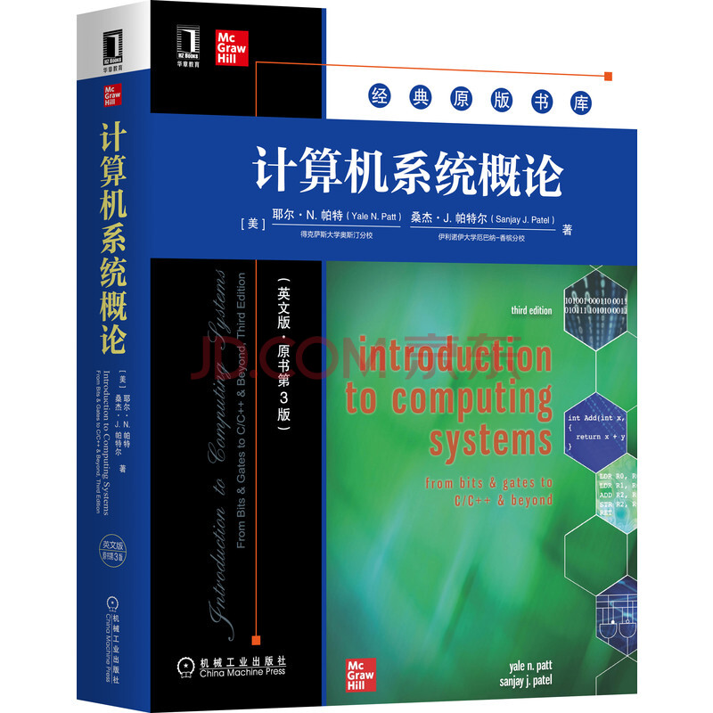

# 计算机系统概论 2022 年秋季

## 说明

课程组首页： <https://acsa.ustc.edu.cn/ics>

本站是 2022 Fall CS1002A.03 班课程主页，课程 qq 群：233961802

- 本站 GitHub 仓库： <https://github.com/liuly0322/ics>
  - Issues and PRs are welcomed
- 作为课程组课程主页 <https://acsa.ustc.edu.cn/ics> 的补充，PPT/作业/实验/讨论课资源及反馈请到课程组主页查阅

本站主要给出一些课程补充资源及实验 Q&A

