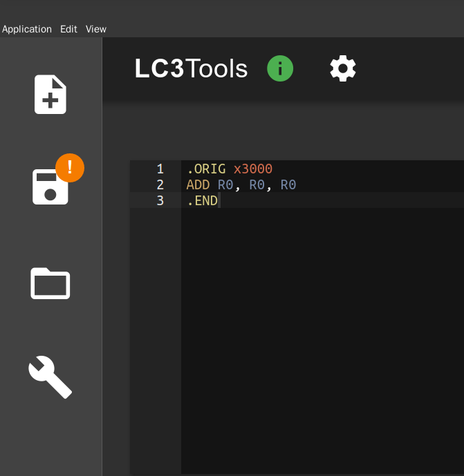
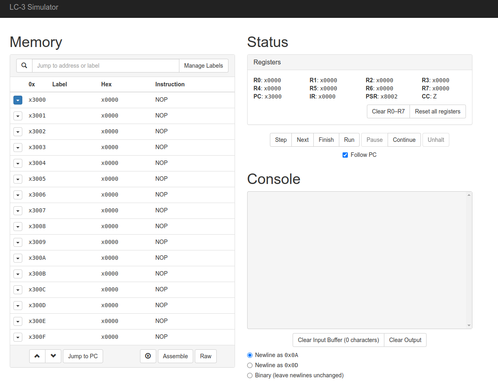

# 资源

## CS 学习资源

- 一个很好的国外名校 CS 课程整理网站：<https://csdiy.wiki>
- 中文技术文档教学网站：[菜鸟教程](https://www.runoob.com/)

CS 入门：

- 系统层面：Computer Systems: A Programmer's Perspective（CSAPP）
  - 推荐阅读教材，选做实验（实验可以在 [官网](http://csapp.cs.cmu.edu/3e/labs.html) 点击每个实验的 Self-Study Handout 和 Writeup 等下载，答案可以在 Github 搜索 CSAPP）
- 软件编程层面：CS61A
  - 课程主页：<https://inst.eecs.berkeley.edu/~cs61a/>，可以选择历史学期听课，如 <https://inst.eecs.berkeley.edu/~cs61a/su20> 对应 20 年暑期学期
  - 推荐看网课，完成作业实验（视频，作业，实验都在课程主页上有）

## 课程第三方软件资源

### lc3tool

LC3 模拟器，github 地址：<https://github.com/chiragsakhuja/lc3tools>

在 [Release](https://github.com/chiragsakhuja/lc3tools/releases) 内可以下载到最新版本的软件

使用说明：<http://acsa.ustc.edu.cn/ics/download/lc3/GuideToUsingLC3Tools.pdf>

点击 `View` 后选择 `Zoom in` 和 `Zoom out` 来缩放 UI 大小

对应快捷键分别是 `Ctrl Shift +` 和 `Ctrl -`

### lc3web

在线版本的 LC3 模拟器，网址 <https://wchargin.com/lc3web/>

