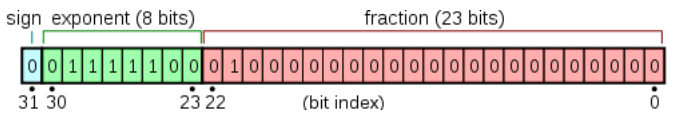

# 数据的位表示

## 整数：补码 (2's complement)

### 编码

编码是给定位数的二进制串到数字的映射，可以看成一个函数 $f$

例如，$n$ 位的原码是一种编码：

$$f(\overline{a_1a_2a_3 ... a_{n}}) = \sum\limits_{i=1}^{n}a_i2^{n-i}$$

2 位的补码也是一种编码：

$$
f(x)=
\begin{cases}
0, & x=\overline{00},\\
1, & x=\overline{01},\\
-2, & x=\overline{10},\\
-1, & x=\overline{11}
\end{cases}
$$

编码 $f$ 的值域是该编码能表示的数的集合。例如，$n$ 位原码的值域是 $[0, 2^n-1]$

### 负数

原码只能表示正数。那么，一个兼容负数的编码 $f$ 该如何设计呢？

从计算机硬件的角度考量，无符号数（原码）的加法器和乘法器是必须的（我们的 LC-3 虽然没有乘法指令，但你也可以自己补充）

我们希望 $f$ 编码下，数字的加法，乘法也能兼容无符号数的加法，乘法

- 减法即加上相反数，因此 $f$ 编码只需要考虑加法，不需要额外考虑减法

我们给出 $f$ 应该满足的性质：

1. 该编码下数字的加法应该等于编码之和（复用无符号数的加法器）

$$f(a) + f(b) \equiv f(a+b) \mod 2^n$$

2. 该编码下数字的乘法也应该等于编码的乘法（复用无符号数的乘法器）

$$f(a)f(b) \equiv f(ab) \mod 2^n$$

3. 该编码应该能表示尽可能多的数字，我们假设 $f$ 是一一映射（即存在反函数 $f^{-1}$ ）

4. 该编码值域应该是连续的 $[-p, q]$ ，其中 $p, q > 0$ ，结合性质三可知 $p+q-1= 2^n$

#### 解法一：

性质二代入 $b = \overline{00...0}$，得

$$f(a)f(\overline{00...0}) \equiv f(\overline{00...0}) \mod 2^n$$

等式左侧 $f(a)$ 是一个变量，等式右侧 $f(\overline{00...0})$ 是一个常数，得：

$$f(\overline{00...0}) = 0$$

性质二代入 $b = \overline{00...1}$，得

$$f(a)f(\overline{00...1}) \equiv f(a) \mod 2^n$$

同理，得：

$$f(\overline{00...1}) = 1$$

再解 $f(a)=-1$:

在性质一中令 $f(a)=-1$，并取 $b = \overline{00...1}$

$$-1 + 1 \equiv f(a+\overline{00...1}) \mod 2^n$$
$$f(a+\overline{00...1}) \equiv 0 \mod 2^n$$

同时取反函数

$$a+\overline{00...1} \equiv \overline{00...0} \mod 2^n$$

$$a=\overline{11...1}$$

已知 $f(\overline{11...1}) = -1$，自然有 

$$
\begin{align*}
-2&=-1 + (-1)\\&=f(\overline{11...1}+\overline{11...1})\\&=f(\overline{11...0})
\end{align*}
$$

同理：

$$
\begin{align*}
-n&=-n+1 + (-1)\\&=f(f^{-1}(-n+1) + \overline{11...1})
\end{align*}
$$

归纳，便得到所有负数 $[-p, -1]$ 对应的补码

而：

$$n+1 = f(f^{-1}(n) + \overline{00...1})$$

归纳，便得到所有正数 $[1, q]$ 的补码

到这里，任意给定一个 $n$ 位二进制串，我们已经能够确定它实际表示的数字了

对于一个二进制串 $x = \overline{a_1a_2a_3 ... a_{n}}$：

- 若 $f(x) \in [1, q]$
  $$f(x) = \sum\limits_{i=1}^{n}a_i2^{n-i}$$
- 若 $f(x) \in [-p, -1]$
  $$\begin{align*}f(x) &= -(2^{n} - \sum\limits_{i=1}^{n}a_i2^{n-i}) \\&= \sum\limits_{i=1}^{n}a_i2^{n-i} - 2^{n}\end{align*}$$

$x$ 所表示的数是正数还是负数由给定的值域确定：二者只有一个是在给定的值域内的（因为值域的长度恰好是二者之差 $2^n$）

事实上，$p, q$ 只要满足 $p+q-1=2^n$ ，它们具体的值是可以任意选取的：

注意到一个二进制串作为正数和作为负数的取值恰好相差 $2^{n}$，而性质一和二都是模 $2^n$ 而言的，可以验证对于不同的 $p,q$ ，这两条性质都成立

这也就导致符合要求的编码方式 $f$ 不唯一

方便起见，通常把 $1$ 开头的二进制串用来表示负数，即值域 $[-2^{n-1}, 2^{n-1}-1]$ ，这也就是通常意义上的补码

#### 解法二：

事实上，无符号数（原码）的加法器和乘法器在考虑溢出的情况下，一个更合适的类比是模 $2^n$ 的同余等价类的加法器和乘法器

例如，在 4 位原码下，$\overline{1101} + \overline{0100} = \overline{0001}$ ，通常而言，这会被认为是溢出

但如果按照模 $2^n$ 的同余等价类的观点来看，$[13] + [4] = [17] = [1]$ ，$17$ 和 $1$ 不过是该等价类的两个代表元，在这个意义上，性质一和性质二的同余符号就不再需要了

$$f(a) + f(b) = f(a+b)$$

$$f(a)f(b) = f(ab)$$

从代数结构的角度，这说明二进制串的结构是一个环，且与模 $2^n$ 的同余等价类同态

不太严谨地，我们直接得出结论：

$$f(x) = [\sum\limits_{i=1}^{n}a_i2^{n-i}] =
\begin{cases}
\sum\limits_{i=1}^{n}a_i2^{n-i},\\
\sum\limits_{i=1}^{n}a_i2^{n-i} - 2^n
\end{cases}$$

具体 $f(x)$ 的取值由值域给定

### 负数的补码表示：

在明白了补码的结构之后，可以轻松证明 $-a$ 的补码表示就是 $a$ 的补码表示取反再加一

$$0 = a+(-a) = f(f^{-1}(a) + f^{-1}(-a))$$

两边取反函数

$$
\begin{align*}
f^{-1}(a) + f^{-1}(-a) &= \overline{00...0} \\&= \overline{11...1} + \overline{00...1}
\end{align*}
$$

移项

$$\begin{align*}
f^{-1}(-a) &= (\overline{11...1} - f^{-1}(a)) + \overline{00...1} \\&= \textasciitilde f^{-1}(a) + \overline{00...1}
\end{align*}
$$

## 浮点数：IEEE 754

我们以 32 位单精度浮点数为例

### float32 内存表示

浮点数类似于科学计数法，分别储存一个数的有效数字和指数

#### sign 符号位

用于标识正负，0 代表正，1 代表负

#### exponent 指数位

8 位无符号整数，范围 $[1, 254]$，实际表示的指数需要减去偏移量 $bias = 127$

$e=0$ 及 $e=255$ 是特殊取值，具体含义后文介绍

#### fraction 尾数位

二进制数的第一个有效数字必定是 $1$，在这之后的 23 位有效数字保存在尾数位 $\overline{a_1a_2...a_{23}}$ 中

故某浮点数实际的有效数字为：$1.\overline{a_1a_2...a_{23}} = 1 + \sum_{i=1}^{23}a_i(\frac{1}{2})^i$

### float32 含义及转换

一般来说 ($e \in [1, 254]$)，float32 表示的是如下的整数：

$$sign \times (1 + \sum\limits_{i=1}^{23}a_i(\frac{1}{2})^i) \times 2^{exponent - bias}$$

求出 $sign, exponent, fraction$ 三部分的过程就是一个数转换为浮点数的过程

- 先将一个数转换为二进制
- 再正则化处理（分解成有效数字和指数）
- 最后按 IEEE 规约，填入符号位，指数位，尾数位

### 非正规形式

即 $e = 0$ 时，此时是浮点数的非正规形式，用来表示极接近 $0$ 的数字，可以认为此时有效数字只有尾数的 $23$ 位，不再假定有第一个有效数字 $1$

此时，指数位的值与 $e=1$ 时相同，为 $2^{-126}$

因此，最小的非 $0$ 正浮点数是 $2^{-23} \times 2^{-126} = 2^{-149}$

值得注意的是，浮点数的 $0$ 其实有两个，在指数位和尾数位全为 $0$ 的前提下，根据符号位，有 $+0.0$ 和 $-0.0$

$1 / +0.0$ ，除法结果根据 IEEE 754 标准应该是正无穷，但不同编程语言考虑体系结构等因素会有不同的实现，故这个运算仅做了解，此处仅展示两个 $0$ 符号位不同导致的区别

<Playground default="1 / 0.0" />

$1 / -0.0$ ，除法结果负无穷

<Playground default="1 / -0.0" />

虽然它们符号不同，但根据定义，这两个数在进行比较时应该是相等的（因此在写代码时，可以不太考虑这两个 $0$ 的区别）

<Playground default="0.0 === -0.0" />

### 特殊值

当 $e = 255$ 时：

- 若小数部分为 0，表示（正/负）无穷（正如上面试一试中你能够得到的结果）
- 若小数部分不为 0，表示 NaN (**N**ot **a** **N**umber)

NaN 仅在含义上表示（这个运算结果）不是一个数，但在类型上，NaN 毫无疑问是一个（特殊的）（浮点）数

<Playground default="typeof NaN" />

结果应该为 `number`

