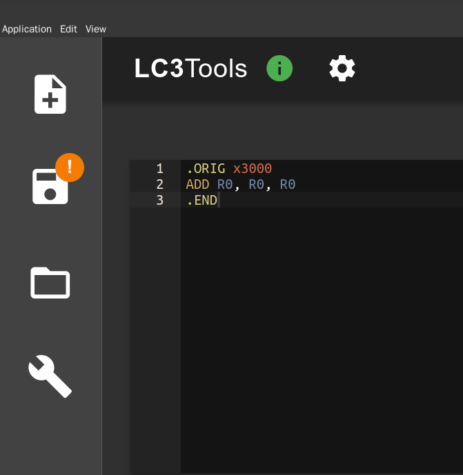
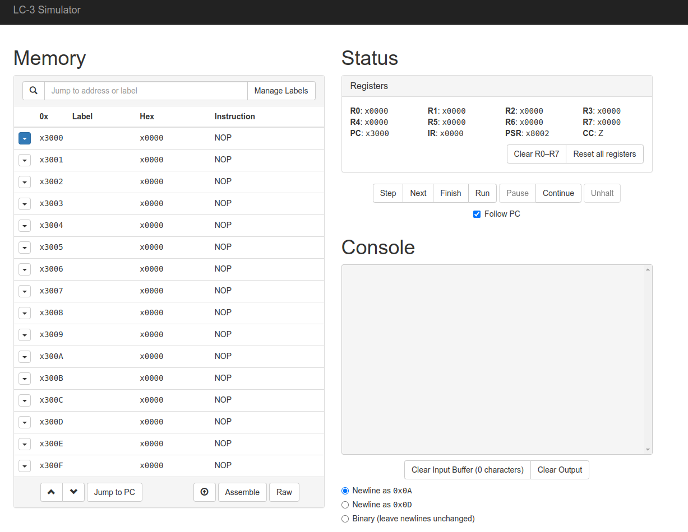

# 课程资源

## lc3 手册

即书后附录部分，介绍了指令集的格式，[链接](http://acsa.ustc.edu.cn/ics/download/lc3/lc3-handbook.pdf
)

## lc3tool

LC3 模拟器

在 [Github Release](https://github.com/chiragsakhuja/lc3tools/releases) 内可以下载到最新版本的软件

- 如果网络环境不支持直接下载，可以尝试使用如下的 ghproxy 链接：
  - MacOS：[点此下载](https://ghproxy.com/https://github.com/chiragsakhuja/lc3tools/releases/download/v2.0.2/LC3Tools-2.0.2.dmg)
  - Linux(AppImage)：[点此下载](https://ghproxy.com/https://github.com/chiragsakhuja/lc3tools/releases/download/v2.0.2/LC3Tools-2.0.2.AppImage)
  - Windows：[点此下载](https://ghproxy.com/https://github.com/chiragsakhuja/lc3tools/releases/download/v2.0.2/LC3Tools-2.0.2.exe)

使用说明：<http://acsa.ustc.edu.cn/ics/download/lc3/GuideToUsingLC3Tools.pdf>

点击 `View` 后选择 `Zoom in` 和 `Zoom out` 来缩放 UI 大小

对应快捷键分别是 `Ctrl Shift +` 和 `Ctrl -`

## lc3web

在线版本的 LC3 模拟器，网址 <https://wchargin.com/lc3web/>

