# VSCode Windows 下 C 环境配置教程

说在前面：

1. **只供感兴趣的同学参考，非必做，做了也不会获得任何形式的加分。**
2. 助教的环境为科大正版软件下的 Win10 镜像，可能存在因系统版本/电脑配置不同导致的配置不成功，也可能存在因助教水平不足造成的疏漏，欢迎各位同学指出，本文也将在 <https://ics.liuly.moe> 进行及时的更新。
3. 请配置有问题的各位一定看一下“注意事项“部分。

## 下载 VSCode

先给出 Windows 64bit 机器的懒人链接 <https://vscode.cdn.azure.cn/stable/784b0177c56c607789f9638da7b6bf3230d47a8c/VSCodeUserSetup-x64-1.71.0.exe>。

其余可以去官网下载：<https://code.visualstudio.com/Download>，这里不挂梯子下载速度可能会很慢，可以用国内镜像，把 `az764295.vo.msecnd.net` 替换成 `vscode.cdn.azure.cn`。

之后就打开 Installer 自动安装就行了。

## 下载 MinGW-w64

这个是编译器，可以认为是 Windows 下的 GCC。C/C++ 是编译语言，而 VSCode 只是文本编辑器，我们需要为其指定编译器。

下载链接为：<https://sourceforge.net/projects/mingw-w64/files/mingw-w64/>，选择前两项中的一个下载（一般下载 `x86_64_posix-seh` 这一项，seh 和 sjlj 的区别感兴趣的可以自行 google）：

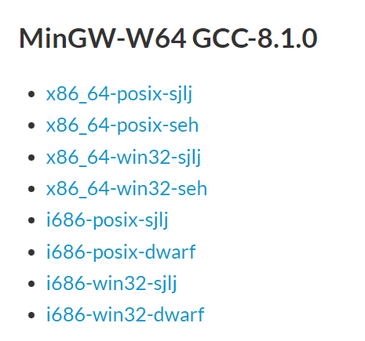

下载完并解压后，可以得到这样的文件夹：

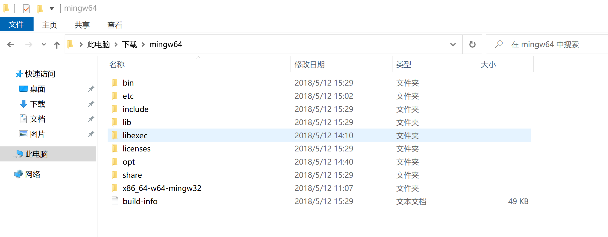

打开 VSCode，通过快捷键 `` ctrl + ` `` （左上角的反斜杠）打开终端（默认使用 Powershell，建议不要用 cmd），输入 `gcc --version`

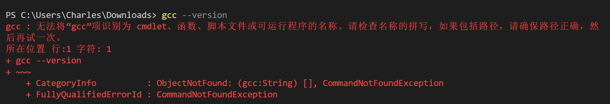

可以发现还不能识别，我们需要把 mingw 所在路径的 `bin` 文件夹路径加到环境变量里。左下角搜索框搜索环境变量：

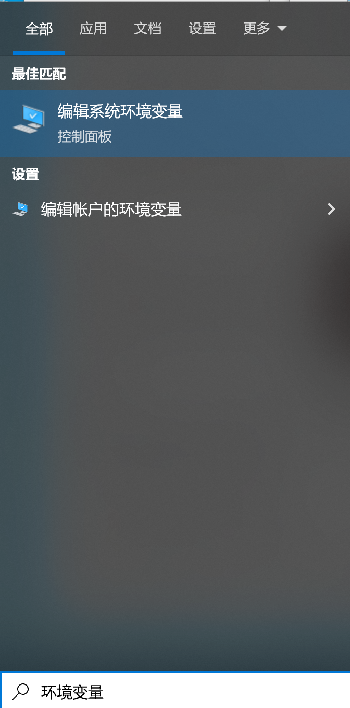

选择“编辑系统环境变量”，点击右下角的“环境变量”，然后双击用户变量或系统变量中的 **Path**（这里如果你就一个用户加在哪都没区别，我这里加在用户变量里），点击右侧的”新建“，将 **`bin` 所在的目录** 添加到环境变量：

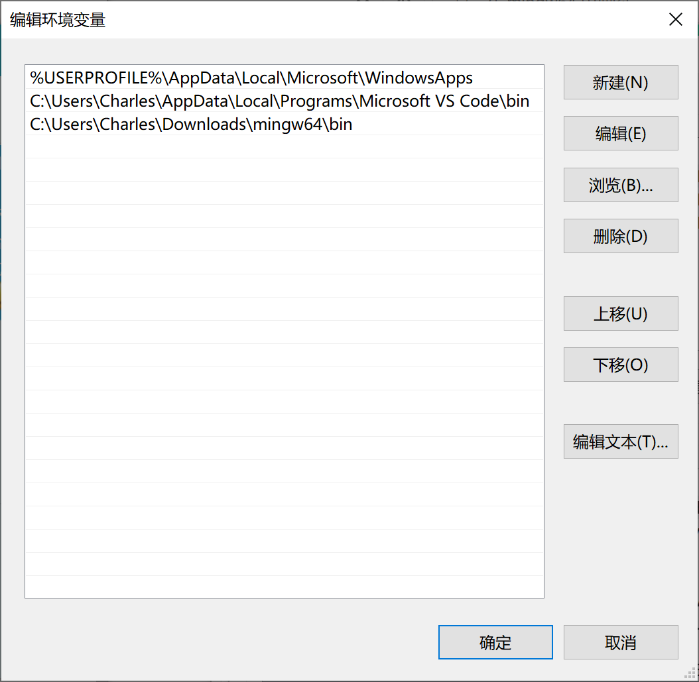

`bin` 目录位置的获取可以通过右键 `bin` 里的任意文件查看属性得到：

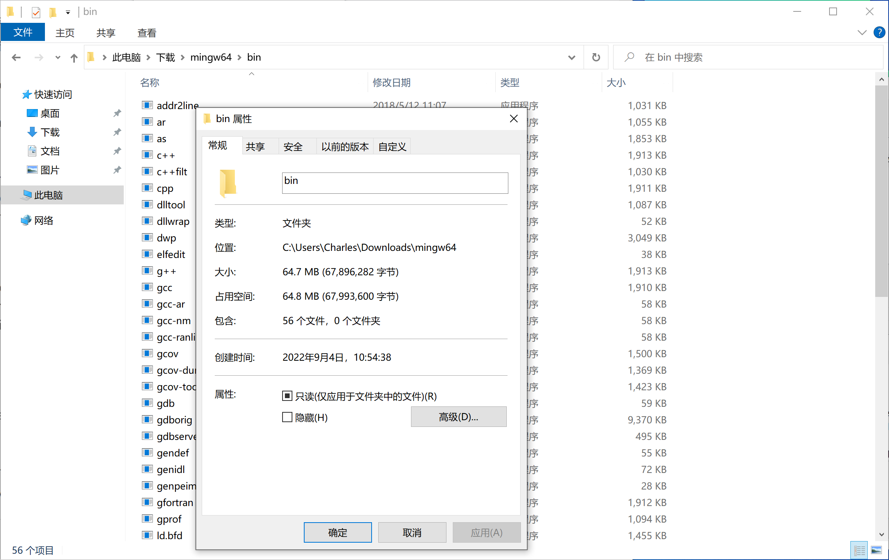

之后重启 VSCode 再次输入 `gcc --version`，如果得到如下输出说明配置成功：

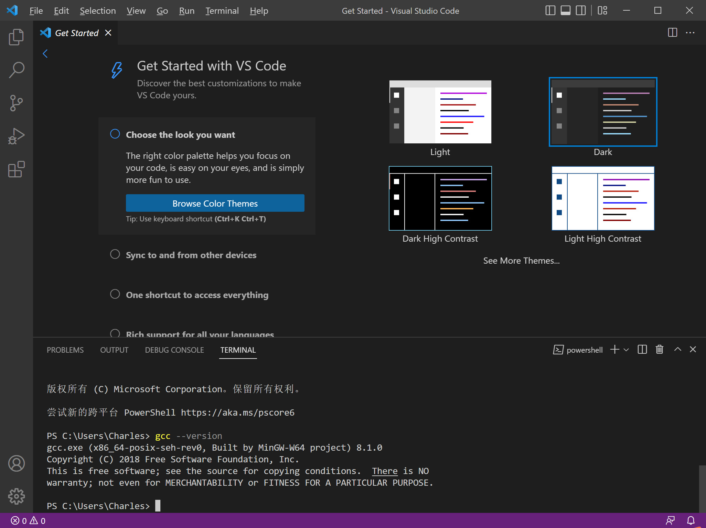

（如果还没有可能需要重启电脑）

## 下载 “C/C++” 插件

搜索 c，装下载量最多的那个（图里第一个）

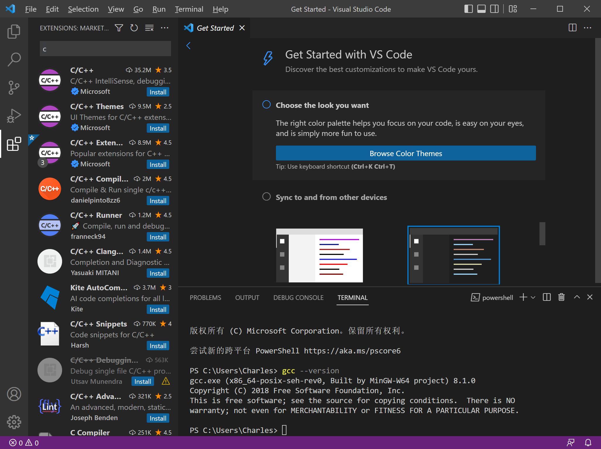

之后随便新建一个文件夹作为你的 C/C++ 工作区，在里面新建文件 `hello_world.c`，内容随便写，保存后按 F5，会跳出如下页面：

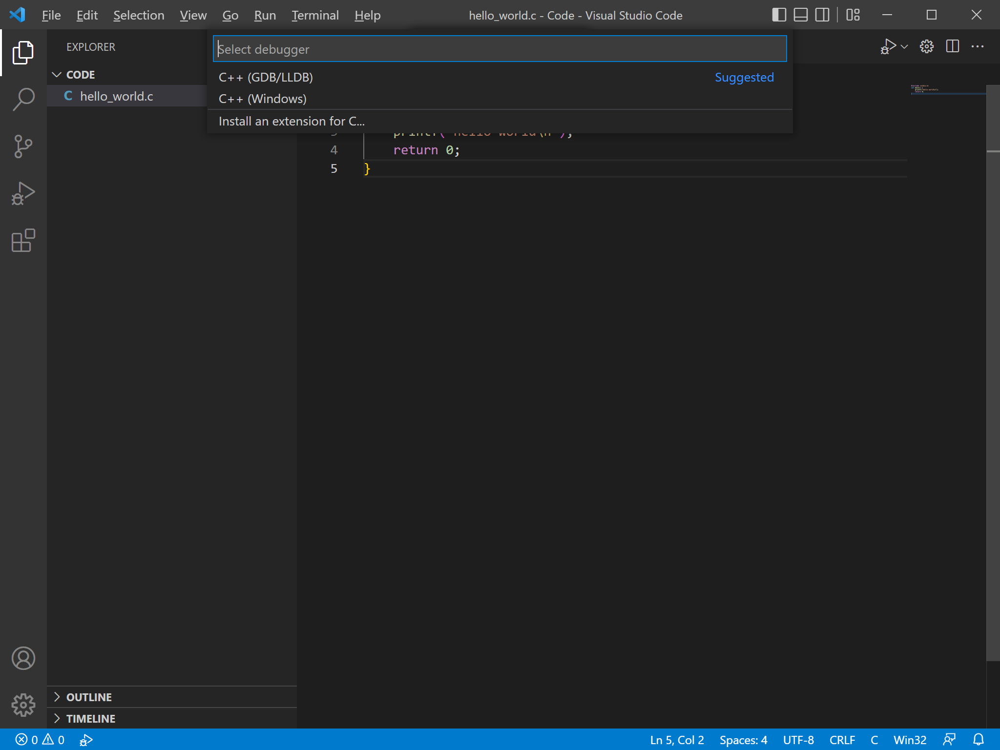

选第一个，之后再选第一个，可以发现已经生成了 `hello_world.exe`，并在终端有了 `hello world` 的输出：

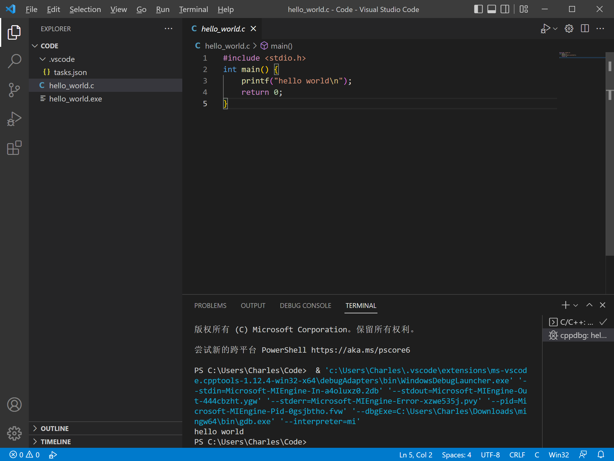

同时可以注意到 VSCode 自动生成了 `.vscode` 目录，里面的 `tasks.json` 内容是这样：

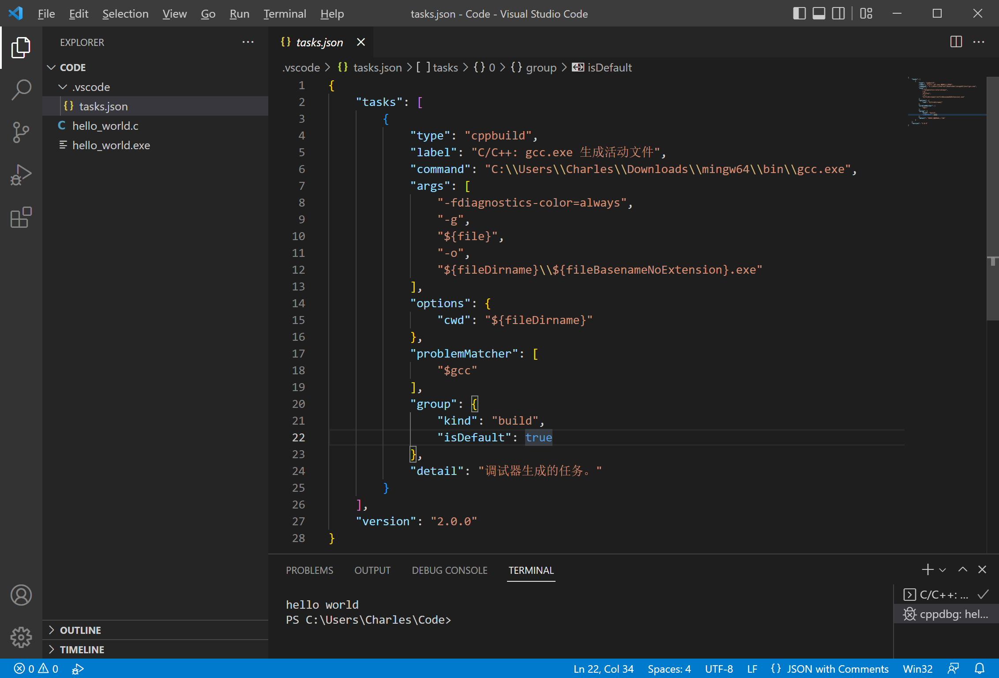

看起来可能有点复杂，其实就是在按 F5 后帮我们执行了 `gcc -fdiagnostics-color=always -g hello_world.c -o hello_world.exe`。如果我们删除 `hello_world.exe`，在命令行手动编译并执行，也一样能得到输出

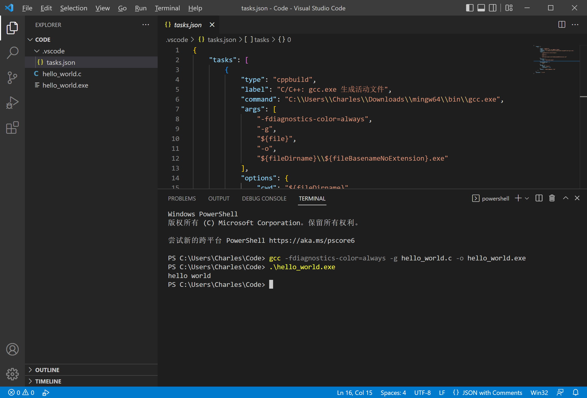

VSCode 比命令行强大的功能在于图形化的 GDB 调试，可以直接在行号左边打断点调试，大家可以自行尝试。

## 注意事项

1. 所有路径都**尽量不要出现中文**。

2. 配置完成后只能在该 workspace 下进行编译，如果新建了 workspace 需要重复上述过程。

3. 如果需要编译 C++ 文件，把 command 里的 `gcc` 改成 `g++`。

4. 如果还是有问题，我提供一组 `launch.json` 和 `tasks.json`，请大家根据注释查看是否需要修改部分配置项（如果 MinGW 已经加入环境变量应该可以直接使用），之后它们拖进 `.vscode` 文件夹即可。

    `launch.json`：

    ```json
    {
      "version": "2.0.0",
      "configurations": [
        {
          "name": "(gdb) Launch",
          "type": "cppdbg",
          "request": "launch",
          "program": "${workspaceFolder}/${fileBasenameNoExtension}.exe",
          "args": [], // 程序调试时传递给程序的命令行参数，新手建议放空
          "stopAtEntry": false,
          "cwd": "${workspaceFolder}",
          "environment": [],
          "externalConsole": false, // 调试时是否显示控制台窗口，建议设为 false
          "MIMode": "gdb",
          "miDebuggerPath": "gdb.exe", // MinGW 已经加入环境变量就不用改，否则要改成你 gdb 的路径
          "preLaunchTask": "compile",
          "setupCommands": [
            {
              "description": "Enable pretty-printing for gdb",
              "text": "-enable-pretty-printing",
              "ignoreFailures": false
            }
          ]
        }
      ]
    }
    ```

    `tasks.json`：

    ```json
    {
      "version": "2.0.0",
      "tasks": [
        {
          "type": "cppbuild",
          "label": "compile", // 跟 launch.json 里面对应
          "command": "gcc.exe", // MinGW 已经加入环境变量就不用改，否则要改成你 gcc 的路径，C++ 就改成 g++
          "args": [
            "-g", // 加该参数才能使用 GDB 调试
            "${file}",
            "-o",
            "${fileDirname}\\${fileBasenameNoExtension}.exe"
          ],
          "options": {
            "cwd": "${fileDirname}"
          },
          "problemMatcher": ["$gcc"],
          "group": {
            "kind": "build",
            "isDefault": true
          },
          "detail": "调试器生成的任务。"
        }
      ]
    }
    ```

## 后话

刚刚只完成了最基本的配置，关于多文件的编译，涉及到链接等知识，后续如有需要会教大家进一步的配置方法，感兴趣的同学可以查阅 [微软官方的文档](https://code.visualstudio.com/docs/editor/debugging) 亦或是 Make 和 CMake 的教程，这里不多赘述。

